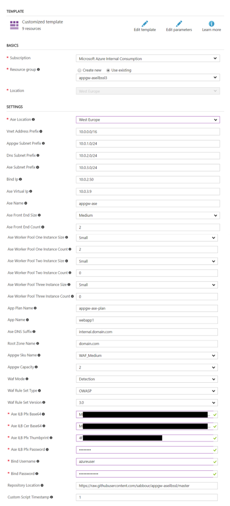
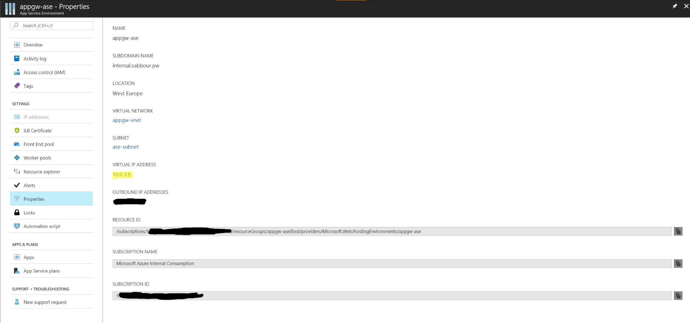
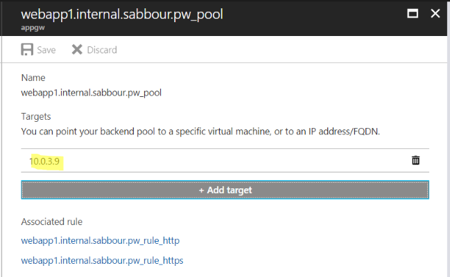
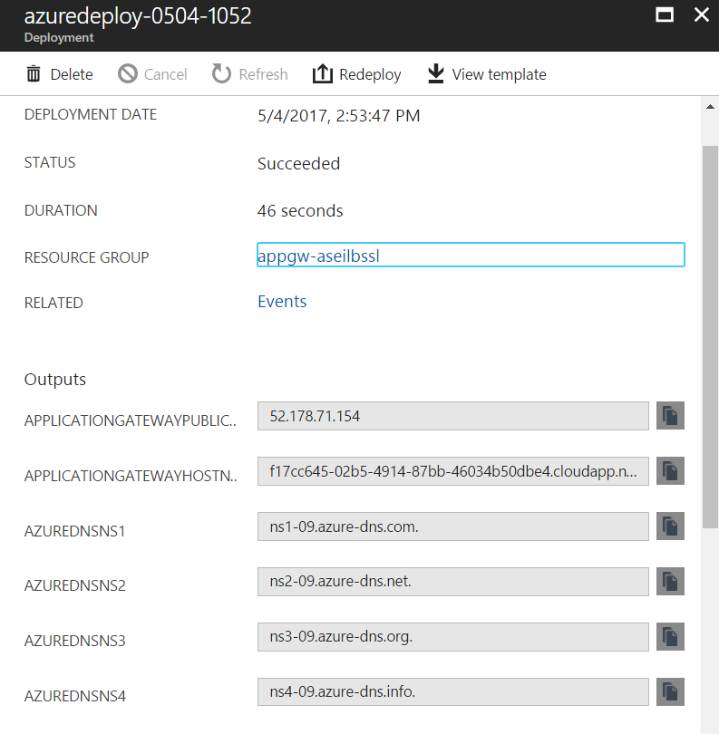
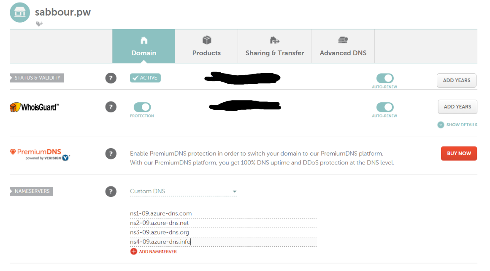

# App Service Environment with an Internal Load Balancer and End-to-End SSL behind an Application Gateway

<a href="https://portal.azure.com/#create/Microsoft.Template/uri/https%3A%2F%2Fraw.githubusercontent.com%2Fsabbour%2Fappgw-aseilbssl%2Fmaster%2Fazuredeploy.json" target="_blank">

</a>
<a href="http://armviz.io/#/?load=https%3A%2F%2Fraw.githubusercontent.com%2Fsabbour%2Fappgw-aseilbssl%2Fmaster%2Fazuredeploy.json" target="_blank">

</a>

This template deploys an **App Service Environment + Application Gateway with End-to-End SSL**.

`Tags: Application Gateway, App Service Environment, Web Application Firewall, Web Apps`

## Solution overview and deployed resources


Note that this template assumes you will use Azure DNS to host your DNS. If you opt to host your domains elsewhere, please fork the template and comment out the relevant Azure DNS sections.

## Prerequisites

Before you deploy the template, you need to have your SSL certificate around.

For this to work smoothly, your certificate should have multiple Subject Alternate Names (SANs) corresponding to the list below. This will ensure a smooth end-to-end encryption experience.
Note that in the context below, **internal.domain.com** refers to the App Service Environment DNS suffix you'll choose.
+ *.domain.com
+ domain.com
+ *.scm.domain.com
+ scm.domain.com
+ *.internal.domain.com
+ internal.domain.com
+ *.scm.internal.domain.com
+ scm.internal.domain.com

You can use the PowerShell scripts below to convert the PFX (with private key) and CER (without private key) to Base64 text to add to the parameters.
You'll find them in text files after you run the script.

+ Export PFX with private key and the certificate thumbprint
```PowerShell
$SecurePassword = Read-Host -AsSecureString  "Enter Certificate password"
$BSTR = [System.Runtime.InteropServices.Marshal]::SecureStringToBSTR($SecurePassword)
$certificatePassword = [System.Runtime.InteropServices.Marshal]::PtrToStringAuto($BSTR)
$cert = New-Object System.Security.Cryptography.X509Certificates.X509Certificate2("certificate.pfx",$certificatePassword)
[System.Convert]::ToBase64String($cert.GetRawCertData()) | Out-File "certificate.pfx.txt"
$cert.Thumbprint | Out-File "wildcard_internal_sabbour_pw.pfx_thumbprint.txt"
```

+ Export CER without private key
```PowerShell
$cer = New-Object System.Security.Cryptography.X509Certificates.X509Certificate2
$cer.Import("certificate.cer")
$bin = $cer.GetRawCertData()
[System.Convert]::ToBase64String($bin) | Out-File "certificate.cer.txt"
```

## Deployment steps

+ You can click the "Deploy to Azure" button at the beginning of this document.
+ Supply the correct parameters for the certificates
+ This will take about 2-hours to deploy



## Post deployment

+ You need to update the Backend Pool address in the Application Gateway with the App Service Environment ILB Virtual IP. For now, this is hardcoded in the template as 10.0.3.9 in the **aseVirtualIp** parameter as there is no easy way to obtain this value. If you don't change anything, you don't need to do this step. Otherwise, you'll need to change it post deployment or change it in the template after it is done and run it again. This should also reflect in the BIND DNS configuration.



+ Update your domain name's nameservers to the ones from the template outputs if you're using Azure DNS, or use either ApplicationGatewayPublicIp or ApplicationGatewayHostname to setup an A record or CNAME for your domain if you're hosting the DNS elsewhere.  



+ You can optionally enable the Web Application Firewall mode on the Application Gateway

## Connecting to your App Service Environment
+ Once the environment is ready and the DNS propagates, open http://yourappname.domain.com and https://yourappname.domain.com, both should work and the latter should be using End-to-End SSL. Note that the **REMOTE_ADDR** is actually the IP of the Application Gateway.


+ To access the Kudu console or FTP, they should be at the following endpoints
   + Kudu: yourappname.scm.internal.domain.com
   + FTP: ftp.internal.domain.com

+ Since the ASE is running behind an Internal Load Balancer, you can't access the endpoints above from outside the Virtual Network. You can either:
   + Create a "jump box" Virtual Machine inside the Virtual Network and use it to access those endpoints
   + Setup a Point-to-Site VPN connection to the Virtual Network and use it to get onto the network. More details here: https://docs.microsoft.com/en-us/azure/vpn-gateway/vpn-gateway-howto-point-to-site-resource-manager-portal
   + Setup a Site-to-Site/Express Route connection to the Virtual Network and use it to get onto the network. More details here: https://docs.microsoft.com/en-us/azure/vpn-gateway/vpn-gateway-howto-site-to-site-resource-manager-portal
